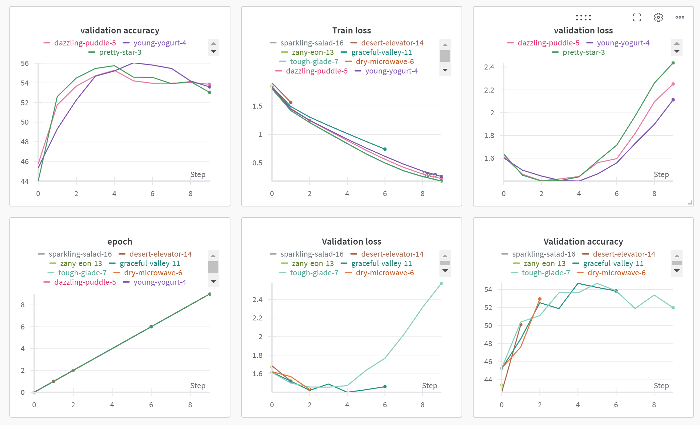
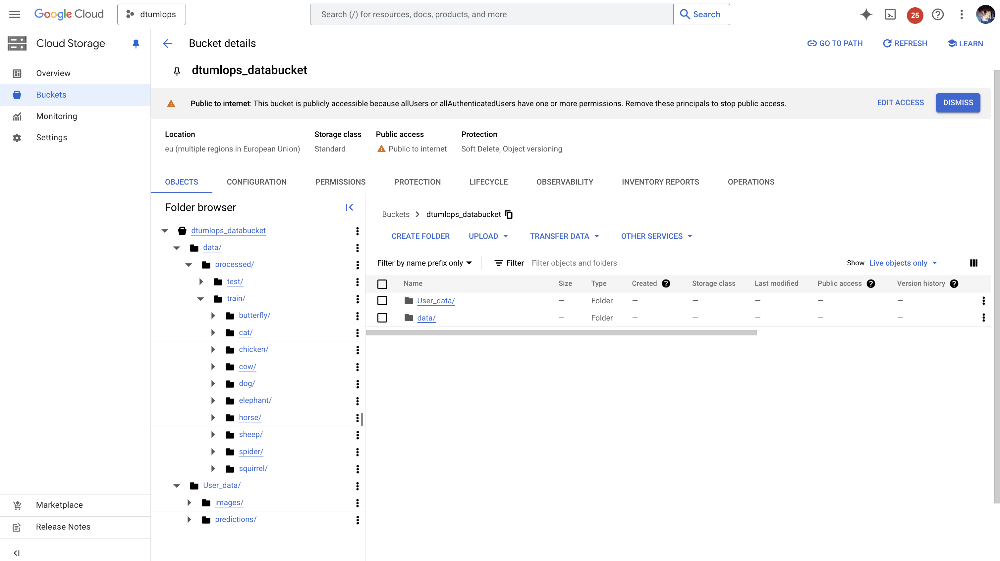
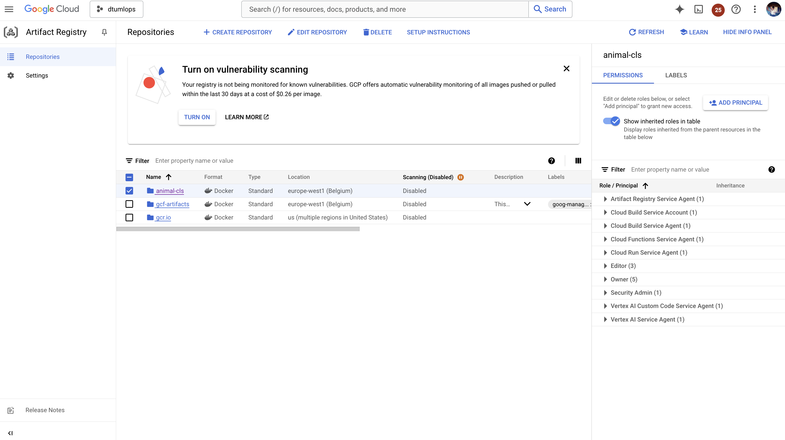
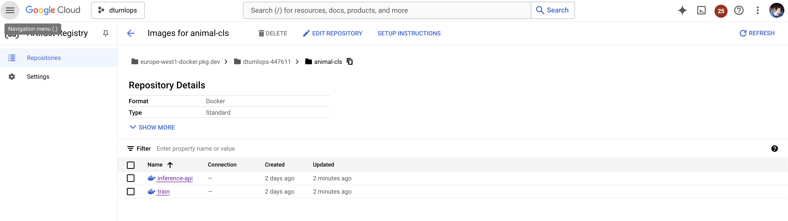
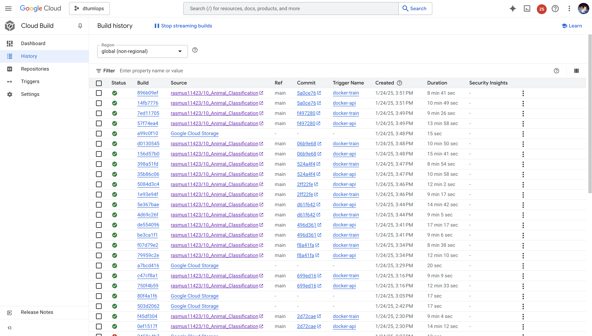
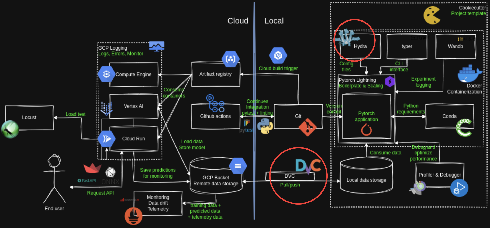

# Exam template for 02476 Machine Learning Operations

This is the report template for the exam. Please only remove the text formatted as with three dashes in front and behind
like:

```--- question 1 fill here ---```

Where you instead should add your answers. Any other changes may have unwanted consequences when your report is
auto-generated at the end of the course. For questions where you are asked to include images, start by adding the image
to the `figures` subfolder (please only use `.png`, `.jpg` or `.jpeg`) and then add the following code in your answer:

```markdown

```

In addition to this markdown file, we also provide the `report.py` script that provides two utility functions:

Running:

```bash
python report.py html
```

Will generate a `.html` page of your report. After the deadline for answering this template, we will auto-scrape
everything in this `reports` folder and then use this utility to generate a `.html` page that will be your serve
as your final hand-in.

Running

```bash
python report.py check
```

Will check your answers in this template against the constraints listed for each question e.g. is your answer too
short, too long, or have you included an image when asked. For both functions to work you mustn't rename anything.
The script has two dependencies that can be installed with

```bash
pip install typer markdown
```

## Overall project checklist

The checklist is *exhaustive* which means that it includes everything that you could do on the project included in the
curriculum in this course. Therefore, we do not expect at all that you have checked all boxes at the end of the project.
The parenthesis at the end indicates what module the bullet point is related to. Please be honest in your answers, we
will check the repositories and the code to verify your answers.

### Week 1

* [x] Create a git repository (M5)
* [x] Make sure that all team members have write access to the GitHub repository (M5)
* [x] Create a dedicated environment for you project to keep track of your packages (M2)
* [x] Create the initial file structure using cookiecutter with an appropriate template (M6)
* [x] Fill out the `data.py` file such that it downloads whatever data you need and preprocesses it (if necessary) (M6)
* [x] Add a model to `model.py` and a training procedure to `train.py` and get that running (M6)
* [x] Remember to fill out the `requirements.txt` and `requirements_dev.txt` file with whatever dependencies that you
    are using (M2+M6)
* [x] Remember to comply with good coding practices (`pep8`) while doing the project (M7)
* [x] Do a bit of code typing and remember to document essential parts of your code (M7)
* [x] Setup version control for your data or part of your data (M8)
* [x] Add command line interfaces and project commands to your code where it makes sense (M9)
* [x] Construct one or multiple docker files for your code (M10)
* [x] Build the docker files locally and make sure they work as intended (M10)
* [x] Write one or multiple configurations files for your experiments (M11)
* [ ] Used Hydra to load the configurations and manage your hyperparameters (M11)
* [x] Use profiling to optimize your code (M12)
* [x] Use logging to log important events in your code (M14)
* [x] Use Weights & Biases to log training progress and other important metrics/artifacts in your code (M14)
* [x] Consider running a hyperparameter optimization sweep (M14)
* [ ] Use PyTorch-lightning (if applicable) to reduce the amount of boilerplate in your code (M15)

### Week 2

* [x] Write unit tests related to the data part of your code (M16)
* [x] Write unit tests related to model construction and or model training (M16)
* [x] Calculate the code coverage (M16)
* [x] Get some continuous integration running on the GitHub repository (M17)
* [x] Add caching and multi-os/python/pytorch testing to your continuous integration (M17)
* [x] Add a linting step to your continuous integration (M17)
* [ ] Add pre-commit hooks to your version control setup (M18)
* [ ] Add a continues workflow that triggers when data changes (M19)
* [x] Add a continues workflow that triggers when changes to the model registry is made (M19)
* [ ] Create a data storage in GCP Bucket for your data and link this with your data version control setup (M21)
* [x] Create a trigger workflow for automatically building your docker images (M21)
* [x] Get your model training in GCP using either the Engine or Vertex AI (M21)
* [x] Create a FastAPI application that can do inference using your model (M22)
* [x] Deploy your model in GCP using either Functions or Run as the backend (M23)
* [x] Write API tests for your application and setup continues integration for these (M24)
* [x] Load test your application (M24)
* [ ] Create a more specialized ML-deployment API using either ONNX or BentoML, or both (M25)
* [ ] Create a frontend for your API (M26)

### Week 3

* [x] Check how robust your model is towards data drifting (M27)
* [ ] Deploy to the cloud a drift detection API (M27)
* [x] Instrument your API with a couple of system metrics (M28)
* [x] Setup cloud monitoring of your instrumented application (M28)
* [ ] Create one or more alert systems in GCP to alert you if your app is not behaving correctly (M28)
* [ ] If applicable, optimize the performance of your data loading using distributed data loading (M29)
* [ ] If applicable, optimize the performance of your training pipeline by using distributed training (M30)
* [x] Play around with quantization, compilation and pruning for you trained models to increase inference speed (M31)

### Extra

* [x] Write some documentation for your application (M32)
* [ ] Publish the documentation to GitHub Pages (M32)
* [ ] Revisit your initial project description. Did the project turn out as you wanted?
* [ ] Create an architectural diagram over your MLOps pipeline
* [x] Make sure all group members have an understanding about all parts of the project
* [x] Uploaded all your code to GitHub

## Group information

### Question 1
> **Enter the group number you signed up on <learn.inside.dtu.dk>**
>
> Answer:

44

### Question 2
> **Enter the study number for each member in the group**
>
> Example:
>
> *sXXXXXX, sXXXXXX, sXXXXXX*
>
> Answer:

s215210, s215160, s215231, s215221, s193473

### Question 3
> **A requirement to the project is that you include a third-party package not covered in the course. What framework**
> **did you choose to work with and did it help you complete the project?**
>
> Recommended answer length: 100-200 words.
>
> Example:
> *We used the third-party framework ... in our project. We used functionality ... and functionality ... from the*
> *package to do ... and ... in our project*.
>
> Answer:

We used the third-party Accelerate libary to optimize our code and optimize our model using mixed precision training of fp-16 and to run efficiently on parallel gpu's. 
To run with accelerate 
```python
accelerate launch src/animal_classification/train.py
```
you can pass in multiple arguments 
```python
accelerate -h 
```
## Coding environment

> In the following section we are interested in learning more about you local development environment. This includes
> how you managed dependencies, the structure of your code and how you managed code quality.

### Question 4

> **Explain how you managed dependencies in your project? Explain the process a new team member would have to go**
> **through to get an exact copy of your environment.**
>
> Recommended answer length: 100-200 words
>
> Example:
> *We used ... for managing our dependencies. The list of dependencies was auto-generated using ... . To get a*
> *complete copy of our development environment, one would have to run the following commands*
>
> Answer:

We used a requirements.txt file to manage our dependencies. To get a complete copy of our environment, one would have to run the following commands:
```bash
pip install -r requirements.txt
```
and to run the development environment, one would have to install the development requirements too:
```bash
pip install -r requirements_dev.txt
```
Docker is also used in our project, we cover this later in the report and there the dependencies are defined in the docker file.

### Question 5

> **We expect that you initialized your project using the cookiecutter template. Explain the overall structure of your**
> **code. What did you fill out? Did you deviate from the template in some way?**
>
> Recommended answer length: 100-200 words
>
> Example:
> *From the cookiecutter template we have filled out the ... , ... and ... folder. We have removed the ... folder*
> *because we did not use any ... in our project. We have added an ... folder that contains ... for running our*
> *experiments.*
>
> Answer:

From the cookiecutter template we have filled out the data, model, docker, dvc, github, configs, dockerfiles, docs, models, notebooks, tests and src folder. We added wandb folder to store the wandb configuration files. We did not deviate from the template structure. Besides that we have added additional folders for example in tests wehre we added subfolders for integration tests, unit tests, and performance tests.

### Question 6

> **Did you implement any rules for code quality and format? What about typing and documentation? Additionally,**
> **explain with your own words why these concepts matters in larger projects.**
>
> Recommended answer length: 100-200 words.
>
> Example:
> *We used ... for linting and ... for formatting. We also used ... for typing and ... for documentation. These*
> *concepts are important in larger projects because ... . For example, typing ...*
>
> Answer:

We used ruff for linting and formatting. We used the library typing for types and mkdocs is present in tasks.py to generate a documentation site. These concepts are important in larger projects because they help in mantaining code consistency, imporove readability for other or new developers, preventing typing mistakes that may be hard to debug and help in the documentation of the code, specially when calling functions or using variables.

## Version control

> In the following section we are interested in how version control was used in your project during development to
> corporate and increase the quality of your code.

### Question 7

> **How many tests did you implement and what are they testing in your code?**
>
> Recommended answer length: 50-100 words.
>
> Example:
> *In total we have implemented X tests. Primarily we are testing ... and ... as these the most critical parts of our*
> *application but also ... .*
>
> Answer:

In total we have implemented 12 tests. Primarily we are testing the data.py file, the model.py file and the api.py files as these are the most critical parts of our application. 

### Question 8

> **What is the total code coverage (in percentage) of your code? If your code had a code coverage of 100% (or close**
> **to), would you still trust it to be error free? Explain you reasoning.**
>
> Recommended answer length: 100-200 words.
>
> Example:
> *The total code coverage of code is X%, which includes all our source code. We are far from 100% coverage of our **
> *code and even if we were then...*
>
> Answer:

The total coverage of the code is 63%, which includes all our source code. We are close to 100% of the code coverage, but even if we were at 100% we would not trust it to be error free. This is because the coverage only checks if the code is executed, not if the code is correct. It is possible to have a code that is executed but is not correct, so the coverage is not a guarantee of the code being error free.

### Question 9

> **Did you workflow include using branches and pull requests? If yes, explain how. If not, explain how branches and**
> **pull request can help improve version control.**
>
> Recommended answer length: 100-200 words.
>
> Example:
> *We made use of both branches and PRs in our project. In our group, each member had an branch that they worked on in*
> *addition to the main branch. To merge code we ...*
>
> Answer:

Each group member tried working on their own branches, making sure to pull changes before they commit, merge and push their own changes. This way we could avoid conflicts and make sure that the code was always up to date. GitHub actions provided a safe way to push to the main repository and prevent any errors from being pushed to the main working repository. This way we could make sure that the code was always working and that the main repository was always up to date.

### Question 10

> **Did you use DVC for managing data in your project? If yes, then how did it improve your project to have version**
> **control of your data. If no, explain a case where it would be beneficial to have version control of your data.**
>
> Recommended answer length: 100-200 words.
>
> Example:
> *We did make use of DVC in the following way: ... . In the end it helped us in ... for controlling ... part of our*
> *pipeline*
>
> Answer:

We didn't use DVC in our project. It would be beneficial to have version control of the data when working with large datasets that are constantly changing. However, we decided against this since we knew we were going to implement a google bucket later on to store the whole dataset and we knew that the dataset is unchanging. On the other hand, we do recognise that it would be useful to store the models and the results of the experiments in DVC, but we decided to use wandb for this purpose. 

### Question 11

> **Discuss you continuous integration setup. What kind of continuous integration are you running (unittesting,**
> **linting, etc.)? Do you test multiple operating systems, Python  version etc. Do you make use of caching? Feel free**
> **to insert a link to one of your GitHub actions workflow.**
>
> Recommended answer length: 200-300 words.
>
> Example:
> *We have organized our continuous integration into 3 separate files: one for doing ..., one for running ... testing*
> *and one for running ... . In particular for our ..., we used ... .An example of a triggered workflow can be seen*
> *here: <weblink>*
>
> Answer:

The continuous integration developed in out project includes linting, formatting, testing and building the docker images. Within .github/workflows/, we have configured workflows that trigger when a push is made to the main branch, these include a code checker with ruff, a test runner with pytest and a dockerfile builder to build container images for the api and the training. Then we ran the tests on differen OS systems and pytests such that our code is working on different configurations. Other than that we are building and pushing the docker image on the cloud. 

## Running code and tracking experiments

> In the following section we are interested in learning more about the experimental setup for running your code and
> especially the reproducibility of your experiments.

### Question 12

> **How did you configure experiments? Did you make use of config files? Explain with coding examples of how you would**
> **run a experiment.**
>
> Recommended answer length: 50-100 words.
>
> Example:
> *We used a simple argparser, that worked in the following way: Python  my_script.py --lr 1e-3 --batch_size 25*
>
> Answer:

We configured the experiments using sweep configuration files, which allows for experiments to be run with different ranges hyperparameters. An added benefit to this approach is the ability to run multiple experiments in parallel and an optimizer (search algorithms) to efficiently search for the best combination of hyperparameters.

We also have separate train and evaluation configuration files which can be adapted and run. Besides that we are using Weights and Biases to log all the runs and experiments where we are logging the following metrics: validation accuracy, validation loss, train loss, train accuracy, and a table including the image and the predicted class and actual class. 

Create the sweep with the following command:
```bash
wandb sweep configs/sweep.yaml
```
and run it with:
```bash
wandb agent <sweep_id>
```
where <sweep_id> is the id of the sweep and is logged in the output of the previous command.

This script runs the experiments with different hyperparameters and logs the results in wandb.

### Question 13

> **Reproducibility of experiments are important. Related to the last question, how did you secure that no information**
> **is lost when running experiments and that your experiments are reproducible?**
>
> Recommended answer length: 100-200 words.
>
> Example:
> *We made use of config files. Whenever an experiment is run the following happens: ... . To reproduce an experiment*
> *one would have to do ...*
>
> Answer:

Thanks to our initial setup, using W&B and sweep configuration files, we ensured that our experiments are reproducible. The config files make sure th  at no information is lost when running experiments and that the experiments are reproducible. Whenever an experiment is run, the configuration is saved in a file that is stored in the wandb folder. This way, we can always go back and check the configuration of the experiments that were run. To reproduce an experiment, one would have to run the same configuration file that was used to run the experiment. This way, we can always go back and check the configuration of the experiments that were run.

### Question 14

> **Upload 1 to 3 screenshots that show the experiments that you have done in W&B (or another experiment tracking**
> **service of your choice). This may include loss graphs, logged images, hyperparameter sweeps etc. You can take**
> **inspiration from [this figure](figures/wandb.png). Explain what metrics you are tracking and why they are**
> **important.**
>
> Recommended answer length: 200-300 words + 1 to 3 screenshots.
>
> Example:
> *As seen in the first image when have tracked ... and ... which both inform us about ... in our experiments.*
> *As seen in the second image we are also tracking ... and ...*
>
> Answer:
```markdown

```


### Question 15

> **Docker is an important tool for creating containerized applications. Explain how you used docker in your**
> **experiments/project? Include how you would run your docker images and include a link to one of your docker files.**
>
> Recommended answer length: 100-200 words.
>
> Example:
> *For our project we developed several images: one for training, inference and deployment. For example to run the*
> *training docker image: `docker run trainer:latest lr=1e-3 batch_size=64`. Link to docker file: <weblink>*
>
> Answer:

Docker was used to create containerized applications for training, inference and deployment. One finds the docker files to create the api and train docker images in the dockerfiles folder. We also previosly mentioned that we used workflows to automatically build these docker images.

To build the train docker image:
```bash
docker build . -f dockerfiles/train.dockerfile -t docker_image
```
The run the image:
```bash
docker run docker_image
```

### Question 16

> **When running into bugs while trying to run your experiments, how did you perform debugging? Additionally, did you**
> **try to profile your code or do you think it is already perfect?**
>
> Recommended answer length: 100-200 words.
>
> Example:
> *Debugging method was dependent on group member. Some just used ... and others used ... . We did a single profiling*
> *run of our main code at some point that showed ...*
>
> Answer:

We used a logger (Loguru) to log some important lines in the code, this aided us in tracking errors and aid in debugging. We also used a profiler in the code to identify bottlenecks in the code via tensorboard, information on how to run the logger is present in the README.md file in the root directory of the project, as well as previous profiler runs stored in the "runs/profiler_logs" folder.

## Working in the cloud

> In the following section we would like to know more about your experience when developing in the cloud.

### Question 17

> **List all the GCP services that you made use of in your project and shortly explain what each service does?**
>
> Recommended answer length: 50-200 words.
>
> Example:
> *We used the following two services: Engine and Bucket. Engine is used for... and Bucket is used for...*
>
> Answer:

Our project makes use of several GCP services. They are listed together with their purpose. VM instances from Compute Engine provide compute power to run our training jobs, deploy models, and perform other tasks with VertexAI. Training from VertexAI helps abstract and manage the underlying VM instance infrastructure, simplifying the building, deployment, and scaling of our model. Buckets from GCP Cloud Storage allow us to store, organize, and manage sharing access to our Animals dataset without using GitHub. Cloud run is used in our project to run fully containerized applications and hosting APIs with ease (without necessarily using a server). Our project also makes use of “APIs and Services” which is the principal location where one is able to manage, discover, enable, and monitor GCP’s various API services. We worked with credentials, API quotas, API dashboard (traffic, errors, median latency).


### Question 18

> **The backbone of GCP is the Compute engine. Explained how you made use of this service and what type of VMs**
> **you used?**
>
> Recommended answer length: 100-200 words.
>
> Example:
> *We used the compute engine to run our ... . We used instances with the following hardware: ... and we started the*
> *using a custom container: ...*
>
> Answer:

While we successfully utilized the GCP Compute Engine for our project, it was challenging to set up. We faced issues such as disk size errors, invalid machine types, and zone errors. The Compute Engine provided the computational power needed to train our deep learning model.

Initially, we used a VM with the n1-standard-1 machine type, which had limited performance and lacked GPU access. To resolve this, we submitted a GPU quota increase request for allRegions. Once approved, we created a VM with 1 x NVIDIA Tesla T4 GPU, offering the necessary performance for our tasks.

The new VM used the pytorch-latest-gpu image from the deeplearning-platform-release project, pre-installed with PyTorch and CUDA, reducing setup time. We selected the n1-standard-4 machine type for sufficient CPU, memory, and GPU resources.

We must mention that settings like install-nvidia-driver=True allowed GPU driver installation for correct configuration and efficient model training. 


### Question 19

> **Insert 1-2 images of your GCP bucket, such that we can see what data you have stored in it.**
> **You can take inspiration from [this figure](figures/bucket.png).**
>
> Answer:


Overview of buckets as required. The selected GCP bucket is the one that is used in our project.




The file structure of our GCP Bucket is shown in further detail here.


### Question 20

> **Upload 1-2 images of your GCP artifact registry, such that we can see the different docker images that you have**
> **stored. You can take inspiration from [this figure](figures/registry.png).**
>
> Answer:




As required, our artifact registry is shown. The docker image on the cloud for our project is highlighted.




We have shown the artifact history further within our project.


### Question 21

> **Upload 1-2 images of your GCP cloud build history, so we can see the history of the images that have been build in**
> **your project. You can take inspiration from [this figure](figures/build.png).**
>
> Answer:




Our cloud build history is shown here.


### Question 22

> **Did you manage to train your model in the cloud using either the Engine or Vertex AI? If yes, explain how you did**
> **it. If not, describe why.**
>
> Recommended answer length: 100-200 words.
>
> Example:
> *We managed to train our model in the cloud using the Engine. We did this by ... . The reason we choose the Engine*
> *was because ...*
>
> Answer:
We successfully trained our model in the cloud using Google Cloud Platform's (GCP) Vertex AI! To begin, we built a Docker container with dependencies, training scripts, and configurations as specified in Module 21, deployed via Vertex AI using a custom (config.yaml), specifying the machine type, GPU (NVIDIA Tesla T4), and replica count.
Before transitioning to Vertex AI, we verified GCP cloud resources by running a HelloWorld.py script on a sample VM instance. This step validated our setup and established that we could scale to a more automated workflow. We enabled Vertex AI by activating the aiplatform.googleapis.com service. We ensured quota availability for GPU resources in our region (europe-west1) simply by getting “allRegions” approved . This quota allowed us to execute custom training jobs using gcloud ai custom-jobs create.
Needless to say, we leveraged GCP’s mounted file system by storing the data in the bucket - greatly improving latency! We also set the correct environment variables in the configuration file. This allowed our project to have easy integration with tools like Weights and Biases. We feel that Vertex AI’s automation and scalability greatly simplified the experimentation process compared to manual setup on Compute Engine VMs.


## Deployment

### Question 23

> **Did you manage to write an API for your model? If yes, explain how you did it and if you did anything special. If**
> **not, explain how you would do it.**
>
> Recommended answer length: 100-200 words.
>
> Example:
> *We did manage to write an API for our model. We used FastAPI to do this. We did this by ... . We also added ...*
> *to the API to make it more ...*
>
> Answer:

We used FastAPI and context manager library to initate a lifespan that instantiates the model and safely closes it when the API is no longer in use such that the end user does not have to wait for the model to load upon each request. We have only a post API to get predictions of an input animal image from the user. 

### Question 24

> **Did you manage to deploy your API, either in locally or cloud? If not, describe why. If yes, describe how and**
> **preferably how you invoke your deployed service?**
>
> Recommended answer length: 100-200 words.
>
> Example:
> *For deployment we wrapped our model into application using ... . We first tried locally serving the model, which*
> *worked. Afterwards we deployed it in the cloud, using ... . To invoke the service an user would call*
> *`curl -X POST -F "file=@file.json"<weburl>`*
>
> Answer:

We managed to deploy the API on cloud using the cloud run service. We dockerized our API on the cloud and it is ready to serve users. To invoke the service a user would call 
'''bash
curl -X POST "https://inference-api-200906448903.europe-west1.run.app/get_prediction" -F "image=@<path_to_image>"
'''


### Question 25

> **Did you perform any unit testing and load testing of your API? If yes, explain how you did it and what results for**
> **the load testing did you get. If not, explain how you would do it.**
>
> Recommended answer length: 100-200 words.
>
> Example:
> *For unit testing we used ... and for load testing we used ... . The results of the load testing showed that ...*
> *before the service crashed.*
>
> Answer:

Yes we did it for the preprocessing of the images function - here we tested with mock images.

### Question 26

> **Did you manage to implement monitoring of your deployed model? If yes, explain how it works. If not, explain how**
> **monitoring would help the longevity of your application.**
>
> Recommended answer length: 100-200 words.
>
> Example:
> *We did not manage to implement monitoring. We would like to have monitoring implemented such that over time we could*
> *measure ... and ... that would inform us about this ... behaviour of our application.*
>
> Answer:

We briefly implemented monitoring following M26 where we did a local host metrics logging. We were able to see the metrics of a user interacting with the API in real time. 

## Overall discussion of project

> In the following section we would like you to think about the general structure of your project.

### Question 27

> **How many credits did you end up using during the project and what service was most expensive? In general what do**
> **you think about working in the cloud?**
>
> Recommended answer length: 100-200 words.
>
> Example:
> *Group member 1 used ..., Group member 2 used ..., in total ... credits was spend during development. The service*
> *costing the most was ... due to ... . Working in the cloud was ...*
>
> Answer:

We used 7 dollars 37. What cost the most for our group was the compute engine because we made use of multiple instances over a lot of time while we did not make much use of the API calls. We noticed that the cloud required more computational time than our local pc's due to hardware constraints on our Quotas. We also noticed that it took really f**cking long to request Quotas - at the end we abaonded the GPU training even though it was convigured but the Quotas were missing. 

### Question 28

> **Did you implement anything extra in your project that is not covered by other questions? Maybe you implemented**
> **a frontend for your API, use extra version control features, a drift detection service, a kubernetes cluster etc.**
> **If yes, explain what you did and why.**
>
> Recommended answer length: 0-200 words.
>
> Example:
> *We implemented a frontend for our API. We did this because we wanted to show the user ... . The frontend was*
> *implemented using ...*
>
> Answer:

We briefly implemented data drifting. The API stores the input data from the user into the data bucket toghether with the model prediction. Locally we wrote a a monitoring.py scripts which compares the current data with the reference data using CLIP. This was tested quikly on some images but due to lack of time we did not explore this further. 

### Question 29

> **Include a figure that describes the overall architecture of your system and what services that you make use of.**
> **You can take inspiration from [this figure](figures/overview.png). Additionally, in your own words, explain the**
> **overall steps in figure.**
>
> Recommended answer length: 200-400 words
>
> Example:
>
> *The starting point of the diagram is our local setup, where we integrated ... and ... and ... into our code.*
> *Whenever we commit code and push to GitHub, it auto triggers ... and ... . From there the diagram shows ...*
>
> Answer:
In general we used everything in the overview.png, besides Hydra due to its incompatibility with typer and DVC due to problems with google authentication as mentioned in the course. 

We have circled in red, the tools that we did not touch upon in the project. We credit the course creators for the figure.



### Question 30

> **Discuss the overall struggles of the project. Where did you spend most time and what did you do to overcome these**
> **challenges?**
>
> Recommended answer length: 200-400 words.
>
> Example:
> *The biggest challenges in the project was using ... tool to do ... . The reason for this was ...*
>
> Answer:
The challenges were definitely working with the cloud. It didn't provide an intuitive interface which we struggled with and required a lot of excessive documentation reading and time only to find out that we are reading the wrong documentation. 

### Question 31

> **State the individual contributions of each team member. This is required information from DTU, because we need to**
> **make sure all members contributed actively to the project**
>
> Recommended answer length: 50-200 words.
>
> Example:
> *Student sXXXXXX was in charge of developing of setting up the initial cookie cutter project and developing of the*
> *docker containers for training our applications.*
> *Student sXXXXXX was in charge of training our models in the cloud and deploying them afterwards.*
> *All members contributed to code by...*
>
> Answer:
s193473 Cloud, training, accelerate framework, API, github actions.
s215231 Data drifting, docker, API
s215160 cookiecutter framework, unit testing, cloud storage, API testing, monitoring.
s215221 GCP bucket, cloud compute engine.
s215210 documentation, model architecture, profiling
